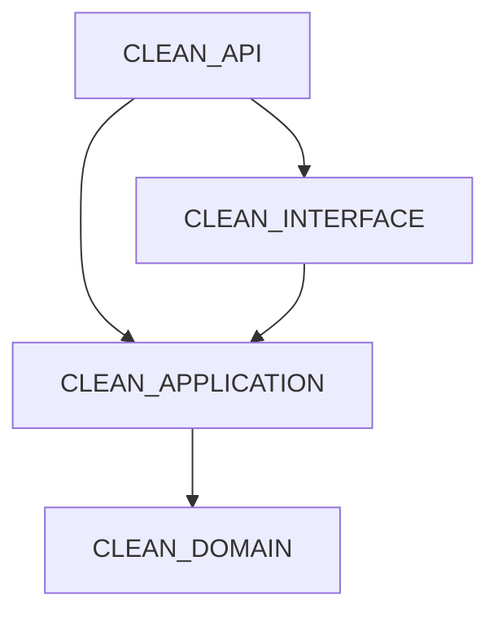

# 🚀 .NET Clean Architecture - Learning & Practice

Chào mừng bạn đến với dự án mẫu triển khai **Clean Architecture** (Kiến trúc sạch) sử dụng **.NET 8**. Đây là môi trường để học tập, thực hành và áp dụng các nguyên tắc thiết kế phần mềm hiện đại như SOLID, CQRS, và Dependency Inversion.

---

## 🏗️ Tổng quan kiến trúc (Architecture Overview)

Dự án được xây dựng dựa trên triết lý của Uncle Bob, tập trung vào việc tách biệt các mối quan tâm (Separation of Concerns) và làm cho mã nguồn độc lập với các framework, UI, hoặc cơ sở dữ liệu.

### 📂 Cấu trúc các Layer

1.  **CLEAN_DOMAIN (Core Layer)**
    *   **Nhiệm vụ**: Chứa các business logic cốt lõi. Đây là lớp trung tâm, không phụ thuộc vào bất kỳ lớp nào khác.
    *   **Thành phần**: Entities, Value Objects, Domain Exceptions, Domain Services, Repository Interfaces.

2.  **CLEAN_APPLICATION (Use Case Layer)**
    *   **Nhiệm vụ**: Điều phối luồng dữ liệu vào và ra khỏi các thành phần domain.
    *   **Thành phần**: Use Cases (Commands/Queries), DTOs (Data Transfer Objects), Mappers, Validators, Application Interfaces.

3.  **CLEAN_INTERFACE / INFRASTRUCTURE (Infrastructure Layer)**
    *   **Nhiệm vụ**: Triển khai các interface được định nghĩa ở các lớp bên trong. Tương tác với các framework bên ngoài.
    *   **Thành phần**: Database Context (EF Core), External API Clients, File Systems, Email Services, Logging.

4.  **CLEAN_API (Presentation Layer)**
    *   **Nhiệm vụ**: Điểm vào của ứng dụng, chịu trách nhiệm nhận và phản hồi các yêu cầu từ phía client.
    *   **Thành phần**: Controllers / Minimal APIs, Middleware, Filters, Swagger/OpenAPI Configuration, Dependency Injection Registration.